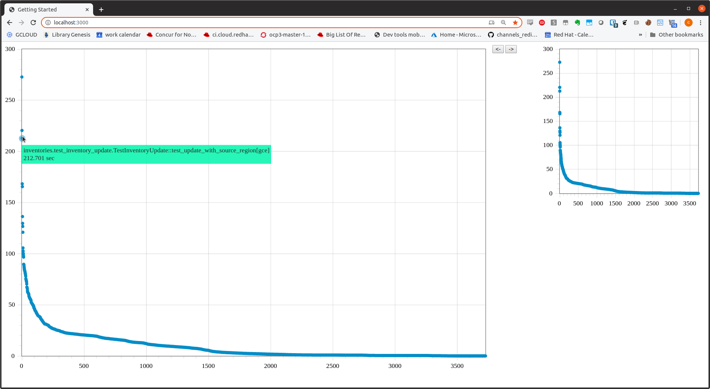
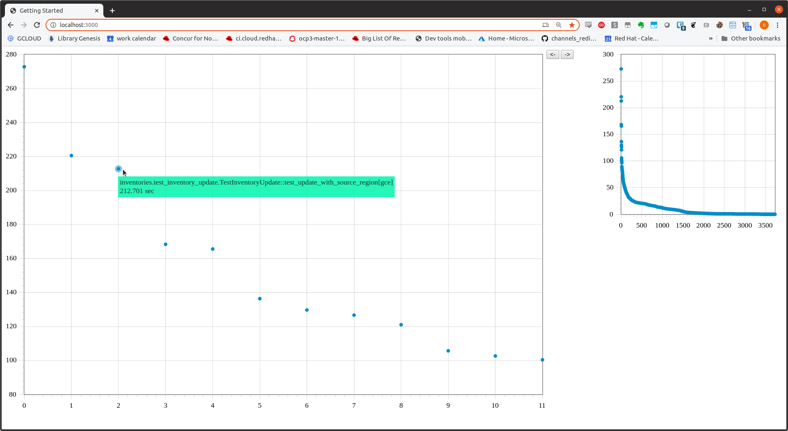

# cihistory


<br>


## Overview
Find slow running pytest tests.

## Getting Started

* Start the server
* Get runs from jenkins
* Push runs from jenkins into ci-history database via the API
* View the results in the UI

<hr>

* Start the server

```
make build
make devel
```

* Get runs from jenkins

```
docker ps <-- find tooling_cihistory_run_<number>
docker exec -it tooling_cihistory_run_1 -it /bin/bash
cd parser

vi secrests.py
username = 'user@domain.com'
api_key = 'hexkey_from_jenkins'
host = 'http://yourjenkins.com'

vi jenkins_to_file.py
JOB_NAME = 'Your_jenkins_job_name_you_want_to_scrape_results_from'
./jenkins_to_file.py

cd sample_data
ls
```

* Push runs from jenkins into ci-history database via the API

```
./results_to_api.py
```

* View the results in the UI

```
http://localhost:3000
```
